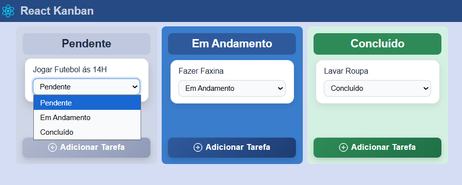

# Kanban Board - React

A Kanban-style task management application built with React as a practical study project.

- Project Status: Completed
- Developed to practice and consolidate React fundamentals.

## Preview



- About the Project

This project simulates a Kanban board where it is possible to:

# Create tasks

- Move tasks between columns

- Organize activities by status

- Work with reusable states and components

The main goal was to apply core React concepts while building a functional and organized interface.

# Concepts Applied

- Functional Components
- Props
- State Management
- Component Reusability
- Conditional Rendering
- TypeScript typing
- Clean project structure

# Technologies Used

- React
- TypeScript
- JavaScript (ES6+)
- CSS
- Vite

# Features

✔ Create new tasks

✔ Move tasks between columns

✔ Component-based architecture

⏳ LocalStorage persistence (Future Improvement)

⏳ Drag and Drop functionality (Future Improvement)


## How to Run the Project

Clone the repository and run the project locally:

```bash
git clone https://github.com/MauroSantosIf/React-Kaban.git
cd React-Kaban
npm install
npm run dev
```

Then open in your browser:

`http://localhost:5173`

# Future Improvements

-> Implement LocalStorage persistence

-> Add Drag and Drop support

-> Improve UI/UX

-> Add task editing and deletion

-> Add animations and transitions

# Purpose

This project represents a practical application of React concepts and an important milestone in my continuous learning journey as a developer.
